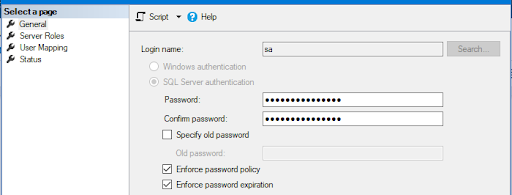
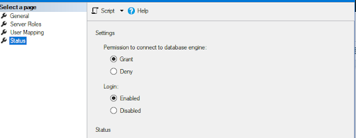
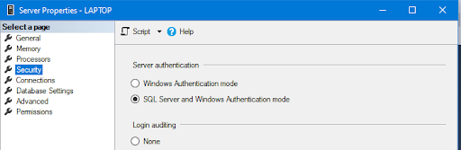
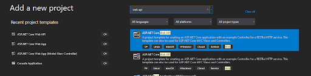
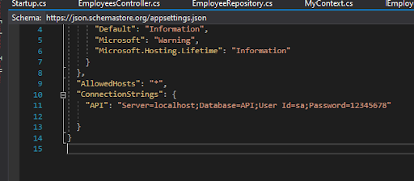
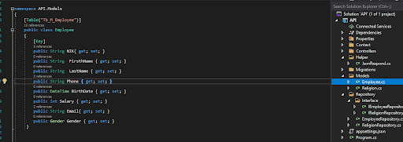
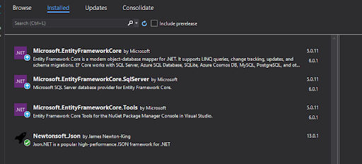
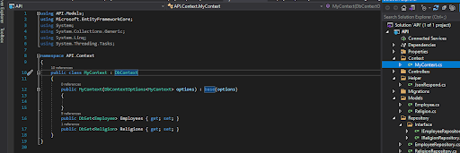
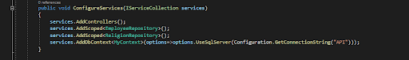

### Generate NIK Incremanet
````

    var empCount = this.Get().Count()+1;
    var Year = DateTime.Now.Year;
    employee.NIK = Year + '0' + empCount.ToString();

````


MCC PART 61-APPLICATIONS DEVELOPER Jr-Rahmat Nur.
# **SEARCHING API** 
## DAILY TASK REPORT
Date: 21 Desember 2021

#### 1. Create new Models "Searching" as attribute objek keyword of searching

````
using System;
using System.Collections.Generic;
using System.Linq;
using System.Threading.Tasks;

namespace API.Models
{
    public class Search
    {
        public String keyword { get; set; }
    }
}

````
#### 2. Create Context Query on repository to find data on your Contex Entity
````
             public IEnumerable<Employee> Search(Search search)
        {

        /*    return myContext.Employees.ToList().Where(e => e.FirsthName == search.keyword || e.NIK== search.keyword || e.LastName == search.keyword);*/
            return myContext.Employees.ToList().Where(e => e.FirsthName.Contains(search.keyword, StringComparison.OrdinalIgnoreCase) || e.NIK == search.keyword || e.LastName.Contains(search.keyword, StringComparison.OrdinalIgnoreCase));  //find with LIKE '${v}$'
        }

````
#### 2. Create new  ActionsResult Method with Route() funtions with custome uri as custome  POST for acces RestAPI
````
        [Route("Search")] //its for made that post method can be acces with custome uri
        [HttpPost]
        public ActionResult Search(Search search)
        {
            try
            {
                var result = employeeRepository.Search(search);
                if (result != null)
                {
                    return Ok(new { status = StatusCodes.Status200OK, result = result, message = $"{search.keyword} Pencarian diproses" });

                }
                else
                {
                    return BadRequest(new { status = StatusCodes.Status204NoContent, result, message = "tidak ada indikasi data ditemukan" });
                }
            }
            catch (Exception e)
            {
                return BadRequest(new { status = StatusCodes.Status417ExpectationFailed, errorMessage = e.Message });

            }
        }
````


# **PRODUCE API .NET CORE** 
Date: 20 Desember 2021


### 1. KONFIGURASI SECURITY MS SQL MANAGEMENT (MSSMS)

# 

Gambar 1. Konfigurasi password acces user dengan id=&#39;sa&#39; MS SQL Server pada _Security -\&gt; Login -\&gt; user_

# 


Gambar 2. Konfigurasi perizinan acces user dengan id=&#39;sa&#39; ke database

# 


Gambar 3. Konfigurasi server security propertie MS SQL agar dapat di akses local network

### 2. MEMBUAT PROJECT BARU

# 

Gambar 4. Membuat Project Baru dengan template _ASP .NET Core WEB API_ dan memastikan menggunakan target _Framework .NET Core 3.1 (Long-term Support)_

### 3. KONFIGURASI SQL DATABASE KONEKSI PADA &quot;APPSETTINGS.JSON&quot;

# 

Gambar 5. Menambahkan attribut _servername ,database,user id,_ dan _password_ sebagaikonfigurasi koneksi dengan MS SQL.

### 4. CREATE MODEL AND DECLARATE ATTRIBUTE, KEY, AND TABLE NAME

# 

Gambar 6. membuat Folder _Models_ lalu menambahkan Class Employee untuk sebagai tempat mendeklarasikan atribut dari beberapa entity yang digunakan.

### 5. INSTALL NUGETPLUGIN YANG DIBUTUHKAN

# 

Gambar 7. Menginstall beberapa library yang dibutuhkan project saat mengenal api.

### 6. MEBUAT CONTEXT FOLDER -\&gt; AND MYCONTEXT.CS FILES YANG BERISI TABLE DECLARATE DAN CONSTRUCTOR UNTUK TURUNAN DBCONTEXT

# 

Gambar 8. Membuat Folder Context lalu menambahkan clas MyContext pada project untuk mendeklarasikan entity/ table database yang digunakan pada project menggunakan fungis turunan dari DbContex dan konfigurasinya.

### 7. KONFIGURASI STARTUP.CS FILES UNTUK DECALARET CONTEXT WITH APPSETTING.JSON PADA CONFIGURESERVICES.

# 

Gambar 9. Menambahkan beberapa Service yag diguanakan seperti Repository , Context dll agar setiap fungsi class add on pada project saling terhubung

1.
# TYPING CODE BELOW TO MIGRATIONS ENTITY TO DATABASE IN THE NUGET CONSOLE.

```

add-migrations migrations\_lable

update-database

```

Gambar 10. Menuliskan dua perintah untuk migrasi konfigurasi Entity dari model dan Context class agar dapat diterapkan pada pada project dan database server.

1.
# CHECK HASIL MIGRASI TADI DI MS SQL


Gambar 11. Dapat kita temukan hasil perintah migrasi sebelumnya pada database setelah melakukan perintah update-database.

1.
# MEMBUAT REPOSITORY UNTUK MENGOLAH DATA MENJADI REST API

1. Membuat folder Interface beserta interface file di dalam repository folder


Gambar 12. pada interface file yang dibuat dengan Convention code name file yang mengikuti aturan penamaan interface file kita akan menulis cetak biru atau kerangka method method yang akan dibuat pada file repository.

1. membuat Repository turunan dari interface


Gambar 13. Secara otomatis repository akan mengikuti kerangka yang dibuat pada interface sebagai parent classnya

e ) Berikut Step yang harus diikuti saat membuat repository dan interface

a) Create Folder Repository

b) Create Folder Interface

c) Create Interface Class with Pascal Case Name

\* Declarate Attribute Acces method (Get,insert,update,delete)

d) Create Repository Class

\* Set Inheritance from Interface

\* Build method Interface

\* Set Repository Constructor for MyContext

\* Set Query Acces GetAll Method from MyContex.EntityName.TolIst();

e) Create Controller API-Empty Class

\* Call repository as private attribute

\* Create Constructor of Controller to build Repository

\* Set Get method and Repository variabel declarate

f) Add Service Scope repository on Startup

1.
# MEMBUAT CONTROLLER


Gambar 14. Pada controller kita deklarasikan class repository dan di panggil dari constructor controller.

1.
# ACCESS CONTROLLER ON THE BROWSER OR POSTMAN


Gambar 15. Menjalankan project agar dapat diakes dari broser dengan menjalankannya tanpa debugging _start without debugging._

r


Gambar 16. Saat project dijalankan a pada browser akan muncul raw data api example sebagai indikator contoh project berhasil dijalankan

1.
# KONFIGURASI METHOD INSERT PADA REPOSITORY

1. mengambil semua data di dalam record


Gambar 17. Agar data pada Entity dapat diakses tentu kita perlu membuat method / instance di dalam repository yang dapat mengembalikan (_return_) nilai yang mengandung semua record data pada table entity.

1. Mengambil data berdasarkan PK


Gambar 18. Instance ini di dalam repository yang berfungsi agar dapat mengembalikan (_return_) nilai yang mengandung sebuah record data yang terkandung dalam entity yag dipilih berdasarkan paramaeter Primary Key.

1. Menambah data kedalam Record


Gambar 19. Dengan instance ini kita bisa menambahkan data pada Context tabel dengan memerhatikan validasi apakah data sudah ada atau tidak, jika data sudah ada maka fungsi ini akan mengembalikan nilai 0 yang akan mengindikasikan data tidak dapat ditambahkan.

1. Method untuk Validasi data email dan Ponsel sebelum ditambahkan


Gambar 20. Pada bagian ini saya membuat sebuah method untuk melakukan validasi penyamaan logika apakah email dan ponsel sudah digunakan oleh user lain. Jika sudah email atau ponsel akan menjadi fungsi yang membatalkan aksi penambahan data. fungsi / method ini dipanggil sebelum eksekusi penambahan data record.

1. Edit/Update data pada salah satu record


Gambar 20. Update didapatkan dari dua parameter dari controller , dimaan a pada parameter pertama sebagai _Primary Key_ kita gunakan sebagai parameter mencari data yang akan di update lalu di replace kembali kedalam Objek Employe sebelum di modified.

1. Menghapus / Delete salah satu data di dalam record


Gambar 20. Pada delete NIK menjadi kunci parameter utama untuk menentukan data mana yang akan di remove pada entity.

1.
# KONFIGURASI METHOD PADA CONTROLLER

1. Method Get ~ untuk menampilkan All data dalam record dilengkapi dengan respond message dan code resond yang direturn dalam bentuk JSON


1. Method Get ~ Mengambil salah satu data dari database dengan Parameter NIK sebagai PK dilengkapi dengan Request respond yang yang di return dalam bentuk JSON


1. Method POST untuk menambahkan data kedalam tabel/ entity database dilengkapi dengan Request response yang yang di return dalam bentuk JSON


1. Method PUT ~ untuk mengubah beberapa attribut didalam salah satu record data dilengkapi dengan Request response yang yang di return dalam bentuk JSON


1. Method Delete ~ untuk menghapus salah satu record data pada table atau database dilengkapi dengan Request response yang yang di return dalam bentuk JSON


1.
# MENGUJI CONTROLLER YANG SUDAH DIBUAT DENGAN POSTMAN

1. Menguji Get semua data


1. Menguji get satu data dengan parameter PK.


1. menguji Insert /POST


1. Menguji update / PUT


1. Menguji delete


20 Desember 2021